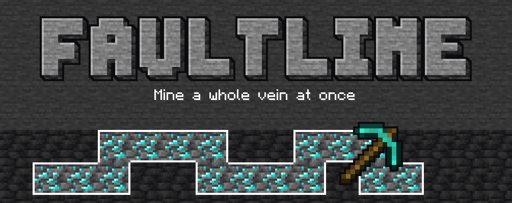

# Faultline



Mine a whole vein at once. Hold the Faultline key (`` ` `` by default) and break a block to take out
every matching block connected to it: ores, logs, stone, anything. It works with any tool or your bare
hand, and the config lets you set the limits.

For Minecraft 26.3 on NeoForge 26.3.0.23-beta or newer.

## Using it

- **Hold the key** to see what would be mined: every block in the selection gets an outline, and a small
  panel in the corner shows the mode and the block count.
- **Break a block** while holding the key to mine the whole selection. Each block costs durability
  and hunger as usual, and Fortune, Silk Touch and other enchantments apply.
- **Scroll** while holding the key to change the mode:
  - **Shapeless**: every matching block connected to the one you broke
  - **Small Tunnel**: a 1x1 line into the face you hit
  - **Mining Tunnel**: 1 wide, 2 tall, into the face you hit
  - **Large Tunnel**: 3x3, into the face you hit
  - **Escape Tunnel**: a 1 wide, 2 tall staircase going up and away from you
  - **Small Square**: a flat 3x3 on the face you hit

Stone and deepslate versions of an ore count as the same block, and so do logs and wood from the same
tree. Leaves are only taken when you start on a leaf.

## Configuration

Server settings (max blocks, max distance, hunger, cooldown, drop gathering, matching rules, enabled
modes) are synced to clients, so the preview always matches what the server will break. Client settings
cover the HUD, the outline colour and scrolling. Both can be edited from the Mods screen.

The server settings file is `faultline-synced.toml` on NeoForge 26.3.0.39-beta and newer, and
`faultline-server.toml` on earlier betas.

Tags for pack makers:

- `faultline:excluded` (blocks): never selected
- `faultline:included_only` (blocks): if it has any entries, only these blocks can be selected
- `faultline:excluded_tools` (items): holding one of these turns Faultline off

## Building

```
./gradlew build
```

The jar ends up in `build/libs`. Use `./gradlew runClient` or `./gradlew runServer` to test.

## License

MIT. See [LICENSE](LICENSE).
